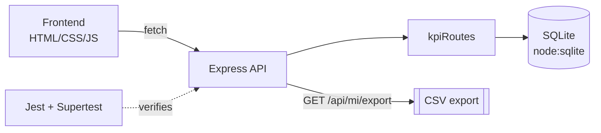

# health-matters-kpi-dashboard 📊

> Full-stack KPI analytics dashboard — a Node/Express API over SQLite with **automated tests** and CSV MI export.

<p>
  
  
  
  
  
</p>

---

## Overview

A full-stack analytics module that simulates the reporting layer of a referral-management system. It exposes KPI summaries, outcome statistics, and a management-information (MI) CSV export, with a lightweight vanilla-JS dashboard on top. Runs **fully locally — no cloud services required.**

## Architecture



## Tech stack

- **Frontend:** HTML, CSS, vanilla JavaScript
- **Backend:** Node.js, Express
- **Database:** SQLite (Node's built-in `node:sqlite`)
- **Testing:** Jest, Supertest

## Prerequisites

- Node.js **22.5+** (required for the built-in `node:sqlite` module)

## Quickstart

```bash
npm install
node backend/server.js       # API on http://localhost:3000
# then open frontend/index.html in your browser
```

Sample data is seeded automatically on first run. Use a different port with `PORT=3001 node backend/server.js`.

## Run the tests

```bash
npm test
```

Supertest validates the API surface:
- `GET /api/kpis/summary`
- `GET /api/kpis/outcomes`
- `GET /api/mi/export`

## Project structure

```text
health-matters-kpi-dashboard/
├── backend/
│   ├── server.js
│   ├── db.js
│   ├── routes/kpiRoutes.js
│   └── tests/api.test.js
├── frontend/            # index.html, style.css, script.js
├── database/database.sqlite
└── package.json
```

## What this demonstrates

- **End-to-end ownership** — data model, API, UI, and tests in one service.
- **API testing discipline** — automated coverage of every endpoint with Supertest.
- **Zero-dependency data layer** — modern Node built-in SQLite, no ORM overhead.

## License

MIT
